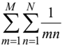

# Programming with Loops and Arrays

## Tasks for Variant №3

Three tasks were implemented as part of this work:

### a) Sum of sequence elements after M

The user inputs:  
- the number of elements `N`;  
- a sequence of real numbers `A`;  
- a real number `M`.  

The program calculates the sum of all elements of the sequence that are located **after the element equal to `M`**.

---

### b) Double summation

The program computes the value of the double sum:

for `M` and `N` entered from the keyboard.

---

### c) Maximum of a function

The program finds the **maximum value** of the function

\[
y = x^3 - 2x + 5
\]

on the interval `[a, b]` with a given step `c`.  
Values `a`, `b`, and `c` are entered by the user.

---

# Программирование с использованием циклов и массивов

## Задания для варианта №3

В рамках этой работы были реализованы три задачи:

### а) Сумма элементов последовательности после M

Пользователь вводит:  
- количество элементов `N`;  
- набор действительных чисел `A`;  
- действительное число `M`.  

Программа вычисляет сумму всех элементов последовательности, расположенных **после числа `M`**.

---

### б) Двойная сумма

Программа вычисляет значение двойной суммы:

для `M` и `N`, введённых с клавиатуры.

---

### в) Максимум функции

Программа находит **максимальное значение** функции

\[
y = x^3 - 2x + 5
\]

на отрезке `[a, b]` с заданным шагом `c`.  
Значения `a`, `b` и `c` задаются пользователем.
